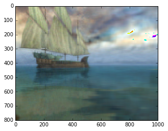
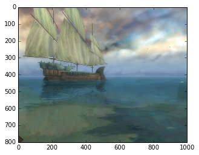

UECM3033 Assignment #2 Report
========================================================

- Prepared by: Tee Yeh Hun
- Tutorial Group: T2

--------------------------------------------------------

## Task 1 --  $LU$ Factorization or SOR method

The reports, codes and supporting documents are to be uploaded to Github at: 

[https://github.com/Yehhun/UECM3033_assign2](https://github.com/Yehhun/UECM3033_assign2)

Explain your selection criteria here.

We can use LU decomposition for both matrix.We need to confirm that the matrix is definite matrix to use SOR with correct variable.
We need also to made the p(Kj) smaller than 1 in order to get omega value. 

Explain how you implement your `task1.py` here.

For the first 3*3 matrix, I am able to use LU decomposition to solve it, then when using SOR method, I found out that the equation p(Kj) is more than one, so I am unable to find optimal omega. That why it is unable to use SOR method. For 6*6 matrix, I am able to find out using LU decomposition method.In SOR method, I am able to find out p(Kj) but unable to get the right answer.This is because 6*6 matrix is not a definite matrix. We need to made the matrix definite in order to find correct solution using SOR.
---------------------------------------------------------

## Task 2 -- SVD method and image compression

Put here your picture file (Lenna.png)

How many non zero element in $\Sigma$?

30 non zero elements.

Put here your lower and better resolution pictures. Explain how you generate
these pictures from `task2.py`.

We generate by using both pictures.
Lower resolution

What is a sparse matrix?

A sparse matrix is a matrix in which most of the elements are zero. By contrast, if most of the elements are nonzero, then the matrix is considered dense. The fraction of non-zero elements over the total number of elements  in a matrix is called the sparsity .
-----------------------------------

last modified: 11-3-2016 
